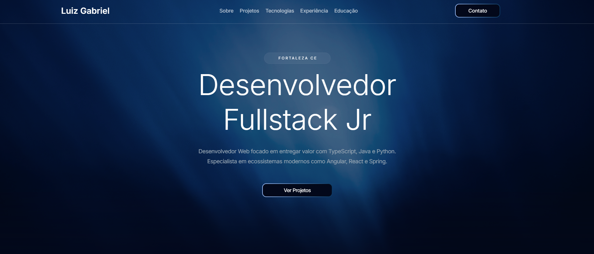

# 🚀 Meu Portfólio Pessoal

<p align="center">
  
  
  
</p>

> Este é o meu portfólio pessoal desenvolvido com **Angular**. Aqui apresento meus projetos, habilidades e trajetória como desenvolvedor(a).

---

## 🎨 Preview




---

## 🛠️ Tecnologias Utilizadas

As principais ferramentas usadas no desenvolvimento deste projeto:

* **Angular 20** 
* **TypeScript** - Tipagem estática para um código mais seguro.
* **SCSS** - Estilização modular e reutilizável.
* ** Vercel 

---

## 🚀 Como Executar o Projeto

Para rodar este projeto localmente, siga os passos abaixo:

1. **Clone o repositório:**
   ```bash
   git clone [https://github.com/seu-usuario/seu-portfolio.git](https://github.com/seu-usuario/seu-portfolio.git)

## Development server

To start a local development server, run:

```bash
ng serve
```


